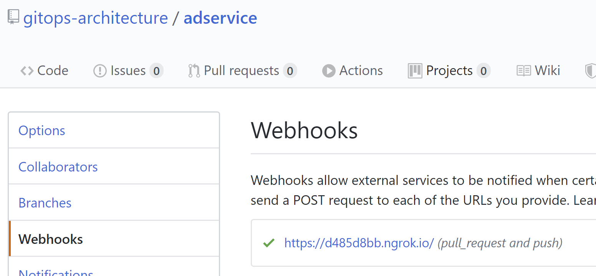
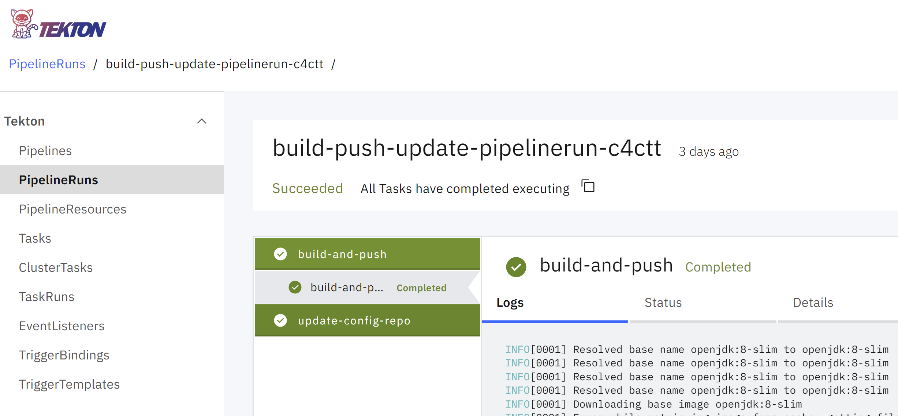
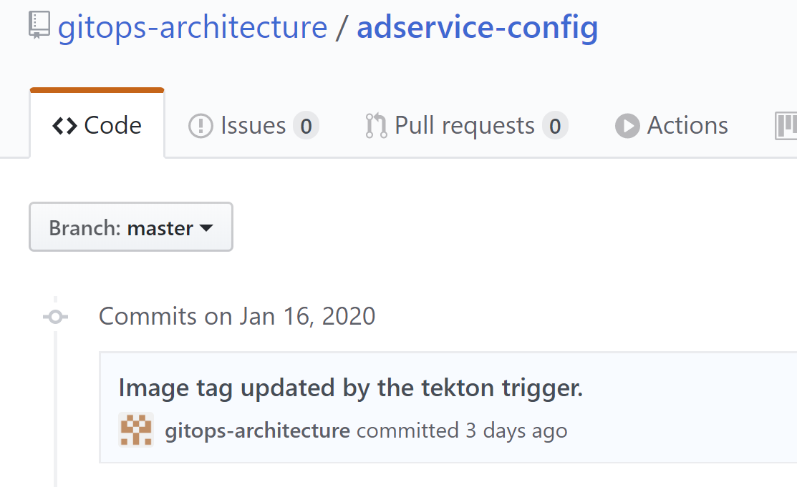

# Reusable Tekton Pipelines for s2i (Source to Image) and Beyond

This repo contains all Tekton manifests (tasks, a pipeline and a trigger) to implement the CI pipeline in our GitOps Reference Architecture as shown in the following architecture diagram:


The CI pipeline in the diagram is a **shared** Tekton Pipeline. The _source code repo_ is configured with a _webhook_, and the webhook is wired to a **shared** Tekton trigger which will create a Tekton PipelineRun once triggered (e.g., in response to a git commit or pull request event) and execute the Tekton Pipeline.

The Tekton Pipeline consists of two Tekton Tasks, a Build Task that build the docker image using _Kaniko builder_ and then push the image to the Docker registry (Docker Hub). The Update (config) Task updates the _configuration repo_ by replacing the docker image tag with the newly generated commit SHA.

The webhooks for source code repos are created by yet another Tekton Task (_create-webhook_).

Follow the following steps to set up Tekton artifacts and create webhooks:

1. Create a k8s secret (replace the place holders with appropriate values):
```
$ cat <<EOF | kubectl create -f -
apiVersion: v1
kind: Secret
metadata:
  name: tekton-trigger-secrets #regcred
  annotations:
    tekton.dev/docker-0: https://index.docker.io 
    tekton.dev/git-0: https://github.com
type: kubernetes.io/basic-auth
stringData:
  username: YOUR_GITHUB_USERNAME
  password: YOUR_GITHUB_PASSWORD
  token: YOUR_GITHUB_PERSONAL_ACCESS_TOKEN
  secret: A_RANDON_STRING
EOF
```
> **Note**:
- The github access token need to have public_repo & admin:repo_hook access.
- Plan texts was used for these sensitive data in the secret example here. We strongly recommend using a secret management technology such as bitnamit's [Sealed-secrets](https://github.com/bitnami-labs/sealed-secrets) or [Hashicorp's Value](https://www.vaultproject.io/) to manage secrets.
2. Run the following commands to set up Tekton Tasks and Pipeline:
```
$ kubectl apply -f serviceaccount.yaml
$ kubectl apply -f role.yaml
$ kubectl apply -f rolebinding.yaml
$ kubectl apply -f task-build-push.yaml
$ kubectl apply -f task-update-config-repo.yaml
$ kubectl apply -f pipeline.yaml
$ kubectl apply -f create-webhook.yaml
```
3. Replace the YOUR_GITHUB_ACCESS_TOKEN place holder in tiggerbinding.yaml with appropriate value and execute the following commands to set up Tekton Tigger:
```
$ kubectl apply -f triggertemplate.yaml
$ kubectl apply -f triggerbinding.yaml
$ kubectl apply -f eventlistener.yaml
```
4. To create a webhook for a service, modify the value for _ExternalDomain_ in the webhook_run of the service's folder and run the following commands:
```
$ kubectl create -f ./adservice/webhook-run.yaml
...... 
```
A smaple webhook is shown in the following screenshot:



Once the webhook is setup for a given code repo, a commit or pull request to the repo with trigger the Tekton pipeline and you should be able to view it in the Tekton Dashboard UI:



Once the PipelineRun completed successfully, the Helm chart in the corresponding configuration repo (e.g., _adservice-config_) will be updated with replaced image tag value and a commit comments written by the Tekton pipeline:



At almost the same time (or a few mintues later, depending on how your Argo CD is configured), the application in Argo CD starts to synchronize and a updated image will be deployed to the Kubernetes cluster.

